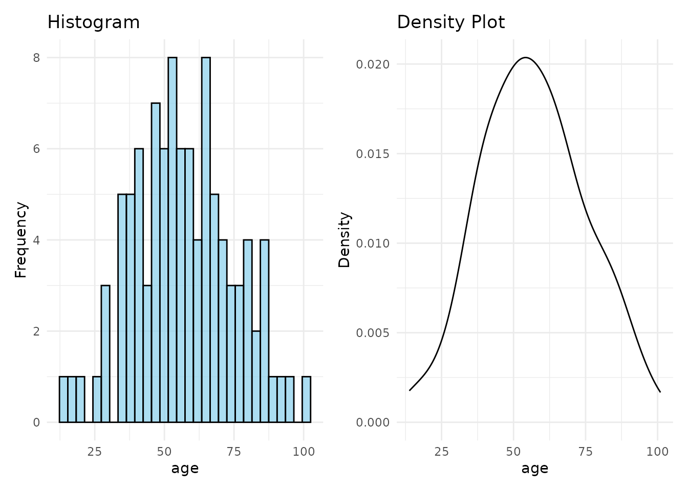
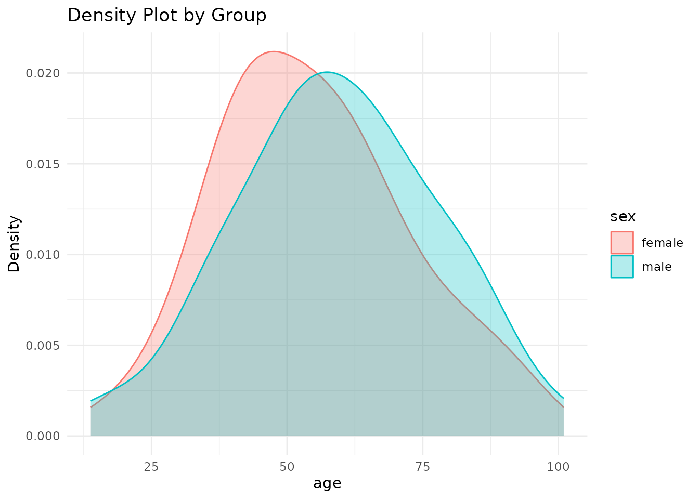
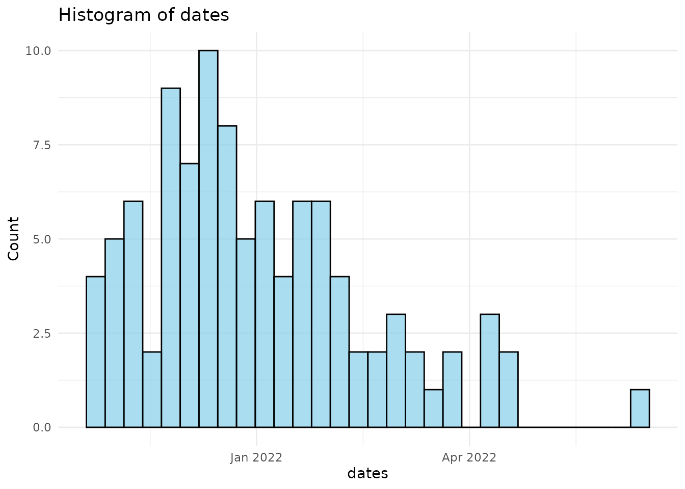
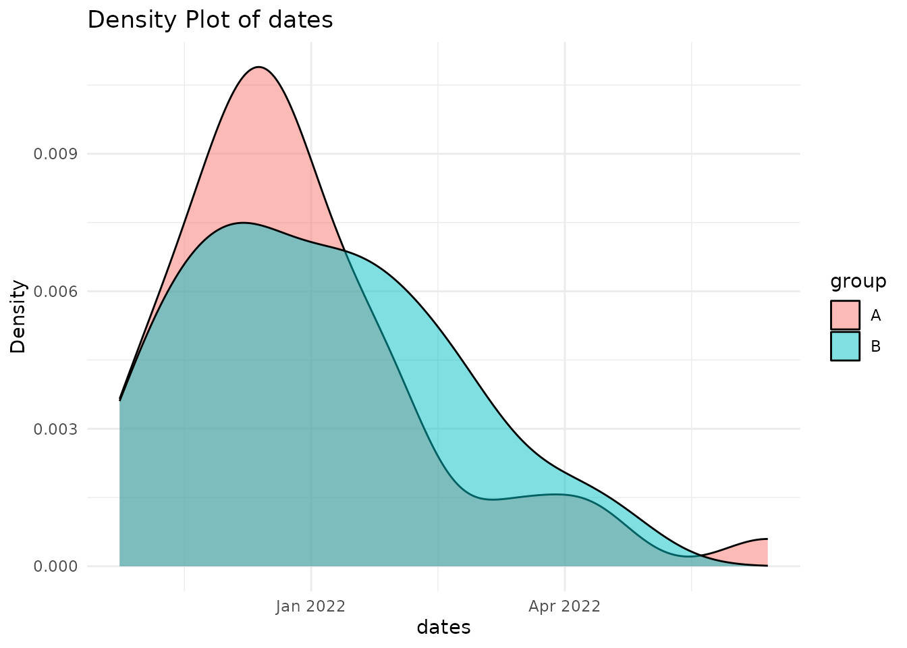
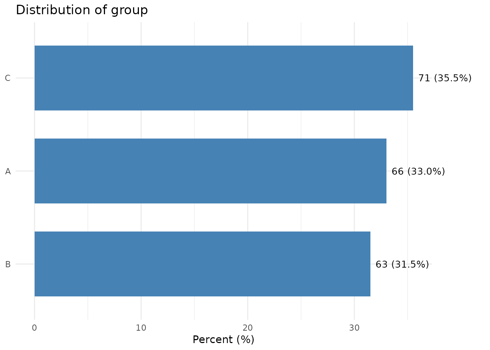
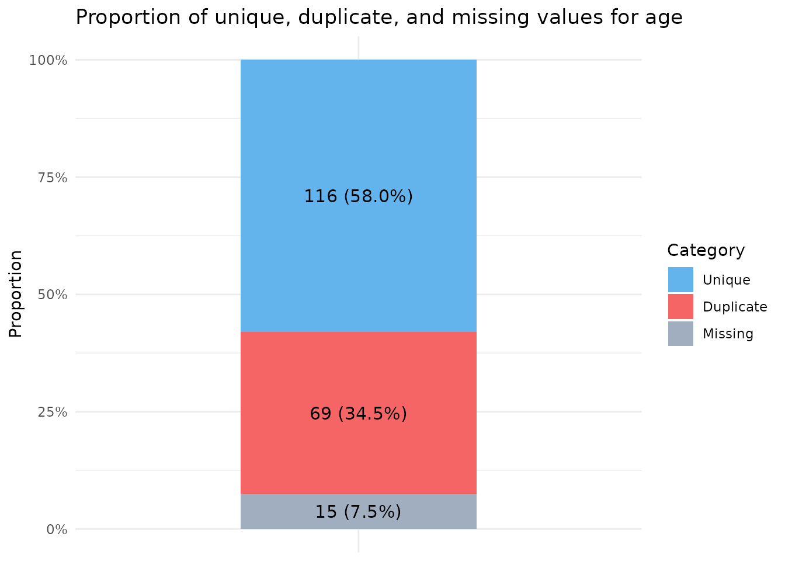
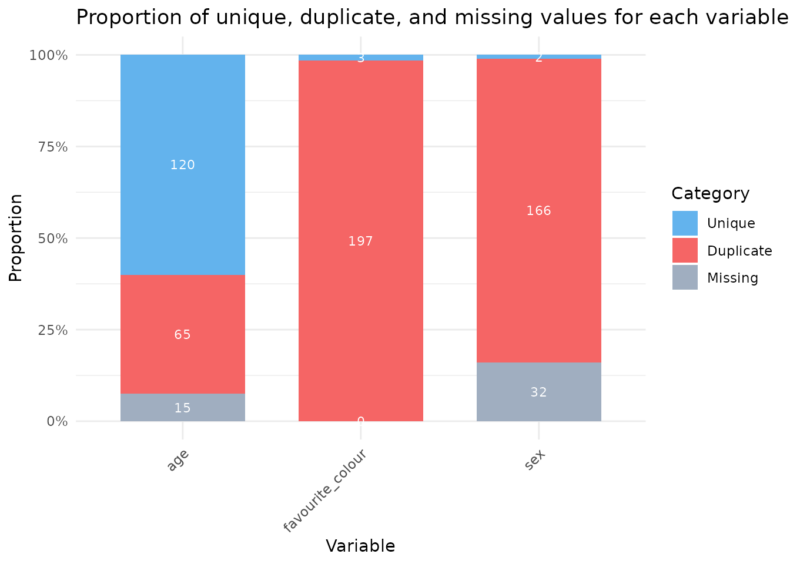

# Exploring data with sumvar

## Introduction

The **sumvar** package provides simple and easy to use tools for
summarising continuous and categorical data, inspired by Stata’s “sum”
and “tab” commands. All functions are tidyverse/dplyr pipe-friendly and
return tibbles.

## Why use sumvar?

- Simple one-line commands to explore variables for R users
- Pipe-friendly tidyverse integration
- Tabular summaries which can be stored as tibbles and used for
  downstream analysis.

When I first moved from Stata to R about 5 years ago, the main thing I
missed was the simplicity of the “sum” and “tab” functions to
efficiently explore data. Most template code to perform these commands,
in introductory R books or tutorials eg.
<https://r4ds.hadley.nz/data-tidy.html>, takes typically 3-5 lines to
replicate these functions in R. I couldn’t find a package that could
quite as simply and efficiently explore data.

Sumvar is fast and easy to use, and brings these variable summary
functions to R.

## Continuous Data

We call **dist_sum()** to explore a continous variable.

The tibble output shows: the number of rows in the data, and number
missing, the median, interquartile range (25th and 75th centiles), mean,
the standard deviation, and 95% confidence intervals using the Wald
method (normal approximation), and the minimum and maximum values.

**Dist_sum()** will show a density plot and histogram for a single
variable, or a grouped density plot when there is a grouping varialbe.

You can save the output from dist_sum as a tibble and use the estimates
for downstream analysis, eg. `sum_df <- df %>% dist_sum(age, sex)`

``` r
# Example data
set.seed(123)
df <- tibble::tibble(
  age = rnorm(100, mean = 50, sd = 20),
  sex = sample(c("male", "female"), 100, replace = TRUE)) %>%
  dplyr::mutate(age = dplyr::if_else(sex == "male", age + 10, age))

# Call dist_sum
df %>% dist_sum(age)
```



    #> # A tibble: 1 × 14
    #>       n n_miss median   p25   p75  mean    sd ci_lower ci_upper   min   max
    #>   <int>  <int>  <dbl> <dbl> <dbl> <dbl> <dbl>    <dbl>    <dbl> <dbl> <dbl>
    #> 1   100      0   55.6  44.0  68.1  56.9  18.2     53.3     60.5  13.8  101.
    #> # ℹ 3 more variables: n_outliers <int>, shapiro_p <dbl>, normal <lgl>
    df %>% dist_sum(age, sex)



    #> # A tibble: 2 × 17
    #>   sex        n n_miss median   p25   p75  mean    sd   min   max n_outliers
    #>   <chr>  <int>  <int>  <dbl> <dbl> <dbl> <dbl> <dbl> <dbl> <dbl>      <int>
    #> 1 female    49      0   52.5  41.1  65.6  54.7  17.6  16.3  93.7          0
    #> 2 male      51      0   57.2  46.8  71.3  59.0  18.6  13.8 101.           0
    #> # ℹ 6 more variables: shapiro_p <dbl>, ci_lower <dbl>, ci_upper <dbl>,
    #> #   normal <lgl>, p_ttest <dbl>, p_wilcox <dbl>

## Dates

To explore the distribution of dates, call **dist_date()** - it is
similar to dist_sum. This can also be grouped by a second grouping
variable. With a single date, a histogram is shown; when a grouping
variable is also called, a density plot is shown.

``` r
df3 <- tibble::tibble(
  dates = as.Date("2022-01-01") + rnorm(n=100, sd=50, mean=0),
  group = sample(c("A", "B"), 100, TRUE)) %>%
  dplyr::mutate(dt = dplyr::case_when(group == "A" ~ dates + 10, TRUE ~ dates))

df3 %>% dist_date(dates)
```



    #> # A tibble: 1 × 7
    #>       n n_miss min        p25        median     p75        max       
    #>   <int>  <int> <date>     <date>     <date>     <date>     <date>    
    #> 1   100      0 2021-10-25 2021-11-26 2021-12-22 2022-01-28 2022-06-12
    df3 %>% dist_date(dates, group)



    #> # A tibble: 2 × 8
    #>   group     n n_miss min        p25        median     p75        max       
    #>   <chr> <int>  <int> <date>     <date>     <date>     <date>     <date>    
    #> 1 A        43      0 2021-10-25 2021-11-25 2021-12-17 2022-01-16 2022-06-12
    #> 2 B        57      0 2021-10-27 2021-12-01 2022-01-03 2022-02-07 2022-04-20

## Categorical Data

**tab1()** produces a tibble showing the distribution of a categorical
variable and illustrates using a horizontal bar chart.

``` r
df2 <- tibble::tibble(
  group = sample(LETTERS[1:3], 200, TRUE)
)

df2 %>% tab1(group)
```



## Two-way tables

**tab()** creates a cross-tabulation of two categorical variables. By
default it shows counts and row percentages, with row and column totals.

``` r
df_tab <- dplyr::tibble(
  treatment = sample(c("control", "treatment"), 100, replace = TRUE),
  outcome   = sample(c("improved", "stable", "worse"), 100, replace = TRUE)
)

df_tab %>% tab(treatment, outcome)
#>            |               outcome                |       
#> treatment  |  improved  |   stable   |   worse    | Total 
#> -----------+------------+------------+------------+-------
#> control    | 15 (30.6%) | 18 (36.7%) | 16 (32.7%) |  49   
#> treatment  | 13 (25.5%) | 18 (35.3%) | 20 (39.2%) |  51   
#> -----------+------------+------------+------------+-------
#> Total      | 28 (28.0%) | 36 (36.0%) | 36 (36.0%) |  100  
#> 
#> Chi-squared: X²(2) = 0.548, p = 0.761
#> Fisher's Exact: p = 0.771
df_tab %>% tab(treatment, outcome, show = "col")  # column percentages
#>            |                 outcome                 |       
#> treatment  |  improved   |   stable    |    worse    | Total 
#> -----------+-------------+-------------+-------------+-------
#> control    | 15 (53.6%)  | 18 (50.0%)  | 16 (44.4%)  |  49   
#> treatment  | 13 (46.4%)  | 18 (50.0%)  | 20 (55.6%)  |  51   
#> -----------+-------------+-------------+-------------+-------
#> Total      | 28 (100.0%) | 36 (100.0%) | 36 (100.0%) |  100  
#> 
#> Chi-squared: X²(2) = 0.548, p = 0.761
#> Fisher's Exact: p = 0.771
df_tab %>% tab(treatment, outcome, test = "chi")  # with chi-squared test
#>            |               outcome                |       
#> treatment  |  improved  |   stable   |   worse    | Total 
#> -----------+------------+------------+------------+-------
#> control    | 15 (30.6%) | 18 (36.7%) | 16 (32.7%) |  49   
#> treatment  | 13 (25.5%) | 18 (35.3%) | 20 (39.2%) |  51   
#> -----------+------------+------------+------------+-------
#> Total      | 28 (28.0%) | 36 (36.0%) | 36 (36.0%) |  100  
#> 
#> Chi-squared: X²(2) = 0.548, p = 0.761
result <- df_tab %>% tab(treatment, outcome)      # save as tibble
#>            |               outcome                |       
#> treatment  |  improved  |   stable   |   worse    | Total 
#> -----------+------------+------------+------------+-------
#> control    | 15 (30.6%) | 18 (36.7%) | 16 (32.7%) |  49   
#> treatment  | 13 (25.5%) | 18 (35.3%) | 20 (39.2%) |  51   
#> -----------+------------+------------+------------+-------
#> Total      | 28 (28.0%) | 36 (36.0%) | 36 (36.0%) |  100  
#> 
#> Chi-squared: X²(2) = 0.548, p = 0.761
#> Fisher's Exact: p = 0.771
```

## Check for duplicate and missing data

To explore the proportion of duplicate values and missing values in a
variable, pass it to **dup()**.

``` r
example_data <- dplyr::tibble(id = 1:200, age = round(rnorm(200, mean = 30, sd = 50), digits=0))
example_data$age[sample(1:200, size = 15)] <- NA  # Replace 15 values with missing.

example_data %>% dup(age)
```



    #> # A tibble: 1 × 7
    #>   Variable     n n_unique n_duplicate percent_duplicate n_missing
    #>   <chr>    <int>    <int>       <int>             <dbl>     <int>
    #> 1 age        200      116          69              37.3        15
    #> # ℹ 1 more variable: percent_missing <dbl>

If you send the whole database to **dup()**, it will produce a summary
of duplicates and missingness in the whole database. **Dup()**
illustrates with a stacked bar chart.

``` r
example_data <- dplyr::tibble(age = round(rnorm(200, mean = 30, sd = 50), digits=0),
                              sex = sample(c("Male", "Female"), 200, TRUE),
                              favourite_colour = sample(c("Red", "Blue", "Purple"), 200, TRUE))
example_data$age[sample(1:200, size = 15)] <- NA  # Replace 15 values with missing.
example_data$sex[sample(1:200, size = 32)] <- NA  # Replace 32 values with missing.

dup(example_data)
```



    #> # A tibble: 3 × 7
    #>   Variable             n n_unique n_duplicate percent_duplicate n_missing
    #>   <chr>            <int>    <int>       <int>             <dbl>     <int>
    #> 1 age                200      120          65              35.1        15
    #> 2 sex                200        2         166              98.8        32
    #> 3 favourite_colour   200        3         197              98.5         0
    #> # ℹ 1 more variable: percent_missing <dbl>

### Automated reports with explorer()

[`explorer()`](https://alstockdale.github.io/sumvar/reference/explorer.md)
generates a single HTML or PDF report summarising all variables in a
data frame — continuous, date, categorical, duplicates, and missing data
— in one step.

``` r
explorer(example_data)                      # HTML report (default)
explorer(example_data, format = "pdf")      # PDF report
explorer(example_data, id_var = "id")       # exclude an identifier column
```

When run interactively,
[`explorer()`](https://alstockdale.github.io/sumvar/reference/explorer.md)
will prompt you to confirm whether any columns named `id` or `pid`
should be excluded from summaries. The report is written to the working
directory and opened automatically in the browser.
